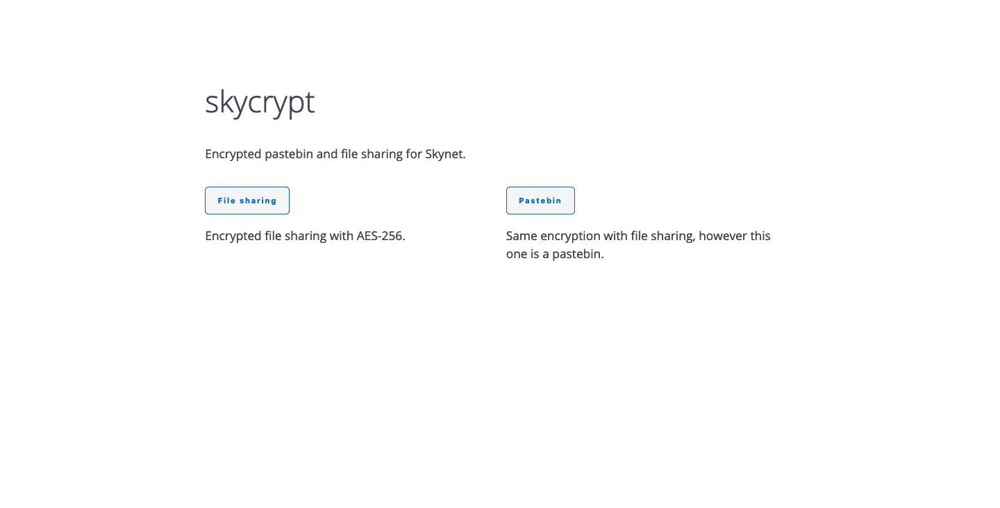
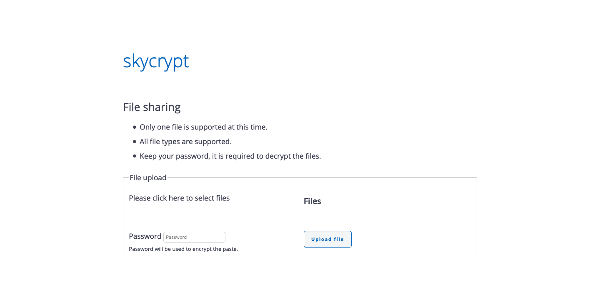

# skycrypt

Encrypted file sharing and pastebin on the Skynet.

### Features

* AES256 encryption with `CryptoJS`.
* Readable client code for decryption.
    * Anyone can write their own client or use other clients to decrypt the encrypted data.

## Screenshots

## Usage

Even though latest version of this project is available on Skynet, you can build this project yourself too.

* `yard install` for installing dependencies
* `yarn build` for production build
* `yarn start` for development build

